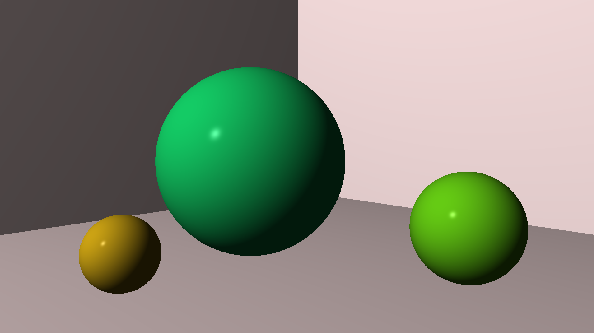

# Raytracer

This is a small cpu based Raytracer which can render a world image live
on the screen.

It is a learning project and programmed after the book "The Ray Tracer Challenge" by Jamis Buck.

## Current Features are:
- Rendering of a hard coded world onto a window
- rendering primitives such as a sphere
- saving a canvas to a file which has to be done manually
- Rendering is happening chunk based and work is spread out over a threadpool


## Features i want to add:
- shadows
- more geometry primitives
- patterns
- CSG rendering
- ability to render obj files
- area lights
- Spotlights
- (maybe) soft shadows
- Feature to define a world in a file and pass it through the executable
- (maybe) expand to gpu based rendering

## How to build

This project uses [CMake](https://cmake.org/) and requires a modern C++ compiler (supporting **C++26**). External dependencies such as [SDL3](https://github.com/libsdl-org/SDL) and [doctest](https://github.com/doctest/doctest) are fetched and configured automatically via CMake.

### Prerequisites

*   **CMake** (v3.31 or higher)
*   **C++ Compiler** (GCC, Clang, or MSVC)
*   **Linux users only:** You need to install the required X11 and Wayland development packages for SDL3 window creation. On Ubuntu/Debian, run:
    ```bash
    sudo apt-get update
    sudo apt-get install cmake build-essential pkg-config \
      libx11-dev libxcursor-dev libxi-dev libxrandr-dev \
      libwayland-dev wayland-protocols libxkbcommon-dev \
      libdbus-1-dev libxss-dev libxtst-dev
    ```
    *(Windows and macOS typically do not require additional system libraries for SDL3).*

### Building the Project

I use an out-of-source build to keep the main repository clean. Execute the following commands from the root of the repository:

```bash
# 1. Configure the project and create the build directory
cmake -B build -DCMAKE_BUILD_TYPE=Release

# 2. Compile the project
cmake --build build --config Release
```

# Example pictures

